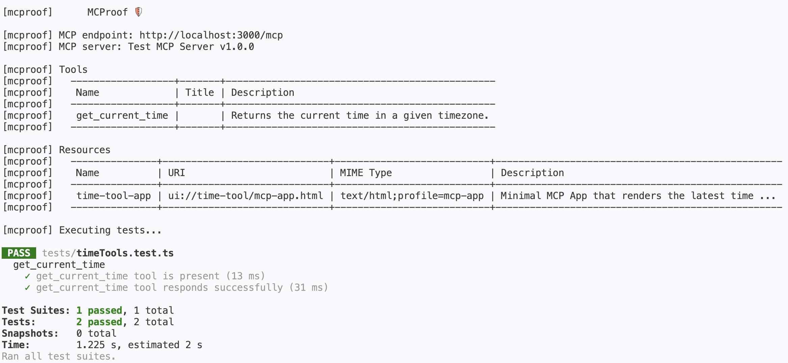
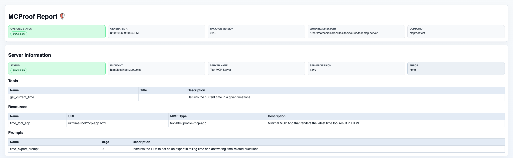
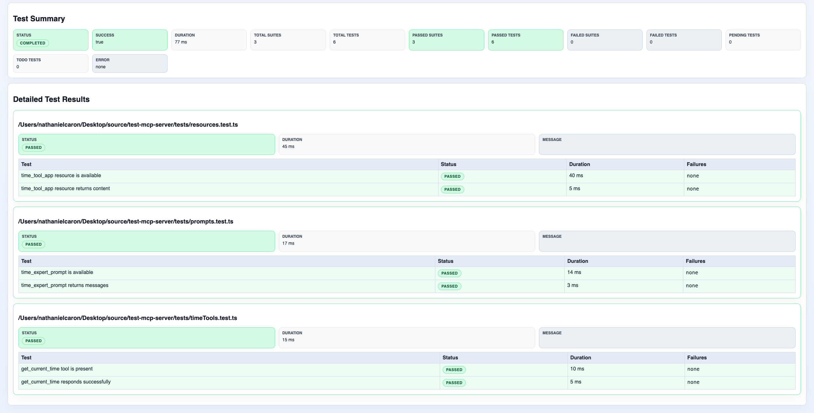

# MCProof 🛡️

MCProof: A framework for testing MCP servers

## Install

```bash
npm install mcproof
```

## Quick Start

Create a `.env.mcproof` file in your project root:

```env
MCPROOF_BASE_URL=http://localhost:36719
MCPROOF_TIMEOUT_MS=10000
MCPROOF_HEADERS='{ "Authorization": "Bearer integration-token", "x-api-key":"demo-key" }'
```

Write granular test files without any local client setup:

`tools.test.ts`

```ts
import { expectTool, expectToolCallContent, expectToolCallSuccess, getSharedMcpTestClient } from 'mcproof';

describe('get_current_time', () => {
  const client = getSharedMcpTestClient();

  test('tool is present', async () => {
    await expectTool(client, 'get_current_time');
  });

  test('responds successfully', async () => {
    const result = await client.invokeTool({
      name: 'get_current_time',
      input: { timezone: 'America/New_York' },
    });

    expectToolCallSuccess(result);
    expectToolCallContent(result, expect.objectContaining({
      timezone: 'America/New_York',
    }));
  });

  test('fails when required input is missing', async () => {
    await expectToolCallError(
      client.invokeTool({ name: 'get_current_time', input: {} })
    );
  });
});
```

`resources.test.ts`

```ts
import {
  expectResource,
  expectResourceReadContent,
  expectResourceReadSuccess,
  getSharedMcpTestClient,
} from 'mcproof';

describe('time_tool_app resource', () => {
  const client = getSharedMcpTestClient();

  test('is available', async () => {
    await expectResource(client, 'ui://time-tool/mcp-app.html', {
      mimeType: 'text/html;profile=mcp-app',
    });
  });

  test('returns content', async () => {
    const result = await client.readResource({ uri: 'ui://time-tool/mcp-app.html' });
    expectResourceReadSuccess(result);
    expectResourceReadContent(result, expect.any(Array));
  });
});
```

`prompts.test.ts`

```ts
import {
  expectPrompt,
  expectPromptGetContent,
  expectPromptGetSuccess,
  getSharedMcpTestClient,
} from 'mcproof';

describe('time_expert_prompt', () => {
  const client = getSharedMcpTestClient();

  test('is available', async () => {
    await expectPrompt(client, 'time_expert_prompt', {
      argumentCount: 0,
    });
  });

  test('returns messages', async () => {
    const result = await client.getPrompt({ name: 'time_expert_prompt' });
    expectPromptGetSuccess(result);
    expectPromptGetContent(result, expect.any(Array));
  });
});
```

Run the suite with the framework CLI:

```bash
npx mcproof test
```

e.g.,


Each CLI test run also writes a simple HTML report under `mcproof-reports/` in your current working directory.

e.g.,



Show the installed package version:

```bash
npx mcproof --version
```

## Testing for Errors

Error assertions support two patterns, but the **promise pattern** is the default and safest option.

**Promise pattern** — pass the promise directly WITHOUT awaiting to catch validation errors:

```ts
test('fails when required input is missing', async () => {
  await expectToolCallError(
    client.invokeTool({ name: 'get_current_time', input: {} })
  );
});

test('fails for invalid URI', async () => {
  await expectResourceReadError(
    client.readResource({ uri: 'invalid://uri' })
  );
});

test('fails for unknown name', async () => {
  await expectPromptGetError(
    client.getPrompt({ name: 'unknown_prompt' })
  );
});
```

**Sync result pattern** — only use this when the SDK returns an error result object (does not throw):

```ts
test('tool call returns error', async () => {
  const result = await client.invokeTool({ name: 'some_tool', input: { bad: 'input' } });
  expectToolCallError(result, 'MCP error -32602: validation failed');
});
```

**Try/catch pattern** — use this when you intentionally want to assert on a thrown error directly:

```ts
test('tool throws when required input is missing', async () => {
  try {
    await client.invokeTool({ name: 'get_current_time', input: {} });
    throw new Error('Expected invokeTool to throw');
  } catch (error) {
    expect(String(error)).toContain('MCP error -32602');
  }
});
```

## Env Configuration

- `MCPROOF_BASE_URL`: required MCP server base URL
- `MCPROOF_TIMEOUT_MS`: optional timeout in milliseconds
- `MCPROOF_HEADERS`: optional JSON object of default headers
- `MCPROOF_HEADER_*`: optional per-header overrides, e.g. `MCPROOF_HEADER_AUTHORIZATION`
- `MCPROOF_ENV_FILE`: optional path to a non-default env file

When both `MCPROOF_HEADERS` and `MCPROOF_HEADER_*` are present, the individual header vars win.

## Advanced Usage

```ts
import {McpTestClient, validateMcpToolCall, expectToolCallSuccess} from 'mcproof';

const client = new McpTestClient({ baseUrl: 'http://localhost:36719', timeoutMs: 10000 });
client.setAuthHeaders({ Authorization: 'Bearer token', 'x-api-key': 'key' });

const validation = validateMcpToolCall({ name: 'ping', requestId: '1' });
if (!validation.isValid) {
  throw new Error(validation.message);
}

const result = await client.invokeTool({ name: 'ping', requestId: '1' });
expectToolCallSuccess(result);

const resourceResult = await client.readResource({ uri: 'resource://weather/current', requestId: '2' });
const promptResult = await client.getPrompt({
  name: 'summarize.weather',
  arguments: { city: 'Montreal' },
  requestId: '3',
});

console.log('result output', result.output);
console.log('resource output', resourceResult.output);
console.log('prompt output', promptResult.output);
```

## API

- `McpTestClient` - core test client with HTTP MCP integration
  - `connect()`
  - `disconnect()`
  - `getAuthHeaders()`
  - `setAuthHeaders(headers)`
  - `clearAuthHeaders()`
  - `listTools()`
  - `listResources()`
  - `listPrompts()`
  - `invokeTool(toolCall)`
  - `readResource(resourceRead)`
  - `getPrompt(promptGet)`

- `installSharedMcpTestClient(config)`
- `configureSharedMcpTestClient(config)`
- `initializeSharedMcpTestClient()`
- `getSharedMcpTestClient()`
- `disconnectSharedMcpTestClient()`
- `resetSharedMcpTestClient()`

- `validateMcpToolCall(call)` - returns `McpProtocolValidationResult`
- `validateMcpToolResult(result)` - returns `McpProtocolValidationResult`
- `validateMcpResourceRead(read)` - returns `McpProtocolValidationResult`
- `validateMcpResourceResult(result)` - returns `McpProtocolValidationResult`
- `validateMcpPromptGet(get)` - returns `McpProtocolValidationResult`
- `validateMcpPromptResult(result)` - returns `McpProtocolValidationResult`
- `expectTool(client, toolName)`
- `expectResource(client, resourceUri, expected?)`
- `expectPrompt(client, promptName, expected?)`
- `expectToolCallSuccess(result)`
- `expectToolCallError(resultOrInvocation[, expectedMessage])`
- `expectToolCallContent(result, expected)`
- `expectToolCallMeta(result, expected?)`
- `expectResourceReadSuccess(result)`
- `expectResourceReadError(resultOrInvocation[, expectedMessage])`
- `expectResourceReadContent(result, expected)`
- `expectResourceReadMeta(result, expected?)`
- `expectPromptGetSuccess(result)`
- `expectPromptGetError(resultOrInvocation[, expectedMessage])`
- `expectPromptGetContent(result, expected)`
- `expectPromptGetMeta(result, expected?)`

## Notes

- Uses the official MCP TypeScript SDK client and streamable HTTP transport.
- Designed for stateless HTTP MCP tooling.
- The default `mcproof test` command enforces sequential Jest execution for the shared-client workflow.
- `mcproof test` writes a timestamped HTML summary to `mcproof-reports/` with preflight discovery details and Jest results.
- The manual shared-client APIs are still available for advanced or non-standard integrations.
